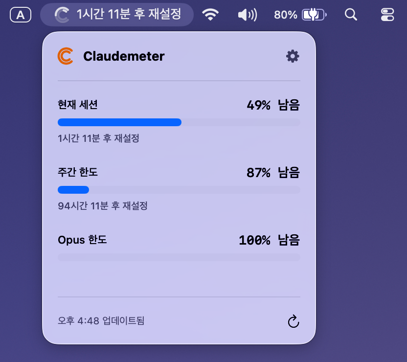

<p align="right">
  <b><a href="./readme.md">한국어</a></b>
</p>

<div align="center">
  
  <h1>Claudemeter for macOS</h1>
  <strong>A macOS menu bar app to monitor your Claude AI API usage.</strong>
  <p>
  <p>
</div>

<p align="center">
  <a href="https://github.com/in-up/claude-meter/releases/latest"></a>
  <a href="https://github.com/in-up/claude-meter/releases"></a>
</p>

---

Claudemeter is a macOS menu bar application that helps you easily track your Claude.ai usage limits. Quickly access your Claude usage via the menu bar control.

### Key Features

- **Real-time Usage Monitoring**: You can check your current session, weekly, and Opus limits in real-time.
  
  <p>

- **Usage Depletion Time Prediction**: It analyzes recent usage fluctuations using Linear Regression to predict the estimated usage depletion time.
    <details>
    <summary>How can I check the predicted depletion time?</summary>
    You can check it by enabling 'Time Left' in 'Settings' > 'Appearance' > 'Text Format'.
    
    The predicted depletion time is displayed based on whichever of the following two moments comes sooner to the user.

    1.  The predicted depletion time obtained by Linear Regression from recent usage changes.
    2.  The time when a new session starts.

    > **Why is it displayed this way?**

      If the estimated depletion time is later than the start of the next session, the user will receive a new session before depleting the current one. Therefore, only one time is displayed to help the user predict the remaining time and plan their usage accordingly.

    </details>

  <p>


- **Notification and Warning Function**: Provides notifications to users when a new session starts or when the set usage limit is reached.

  

  
  <p>
- **User Customization**: You can choose the icon shape and the text to be displayed (remaining time, usage (%), etc.) to suit your preference.

  

  
  <p>

- **Light & Dark Mode Support**: Seamlessly integrates with your macOS appearance.
- **Automatic Update Check**: Stay up-to-date with the latest version to respond to Claude.ai API and feature updates.

---

### Installation

1.  Go to the [**Release**](https://github.com/in-up/claude-meter/releases/latest) page.
2.  Download the `Claudemeter.dmg` file.
3.  Open the installer and drag `Claudemeter.app` to your `Applications` folder.

### How to get a Session Key?

1.  Open the Claudemeter app. A new icon will appear in your menu bar.
2.  To get your `sessionKey`, visit [claude.ai](https://claude.ai), open your browser's developer tools, go to the `Application` (or `Storage`) tab, find the cookies for `claude.ai`, and copy the value of the `sessionKey` cookie.
3.  Click the Claudemeter icon in the menu bar and open **Settings**.
4.  In the **General** tab, paste your `sessionKey` into the 'Session Key' input field.
5.  Your usage data will now be displayed in real-time. You can further modify the app's appearance and notifications in the settings screen.

<p>

### Resolving Security Warning
If you see a security warning when launching the app, either Control-click the app and select **Open**, or enter the following command in the terminal:

```Bash
xattr -cr /Applications/Claudemeter.app
```

---

### Application License


**MIT License (Open Source License)**

### Disclaimer
This application is an independent, unofficial tool and is not affiliated with, endorsed by, or sponsored by Anthropic, PBC. 'Claude' and 'Claude.ai' are trademarks of Anthropic, PBC. All other product names, logos, and brands are property of their respective owners.
