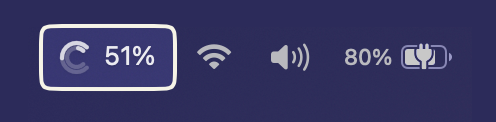
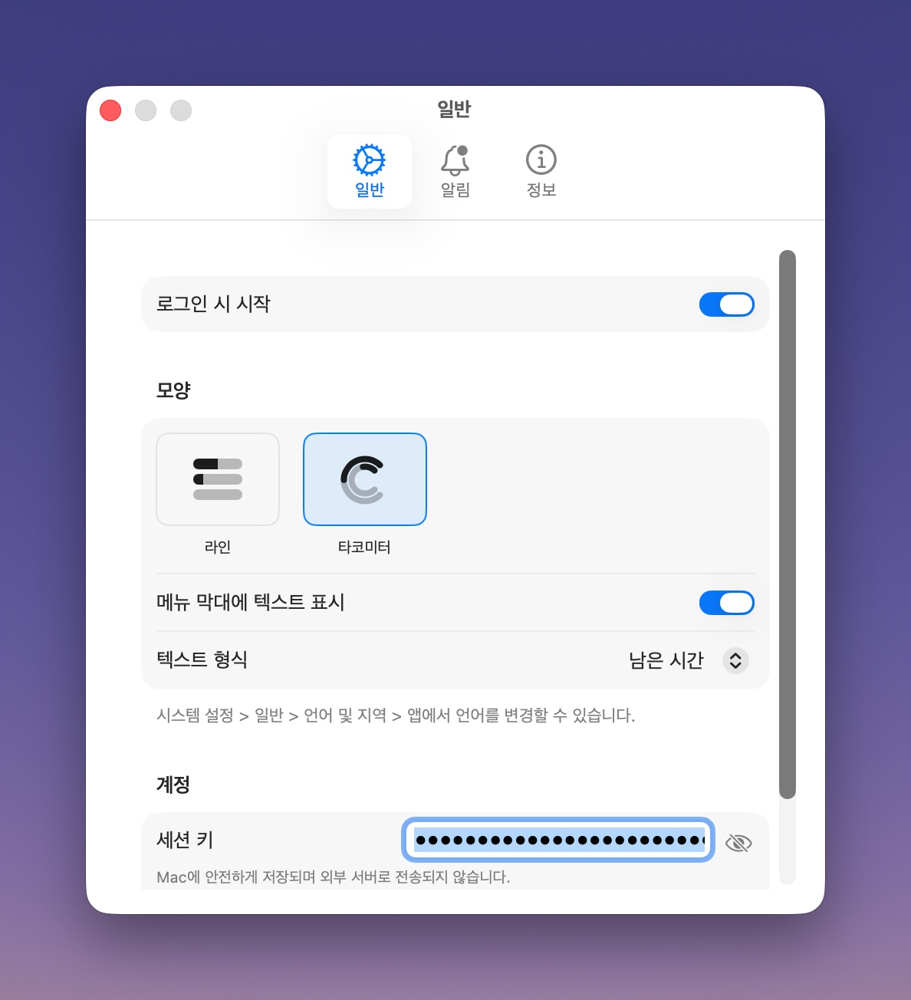

  <b><a href="./README.ko.md">한국어</a></b>

  
  <h1>Claudemeter</h1>
  <strong>A macOS menu bar app to monitor your Claude AI API usage.</strong>
  

  

  

  
  

---

Claudemeter is a macOS menu bar application that helps you easily track your Claude.ai usage limits. Quickly access your Claude usage via the menu bar control.

### Key Features

- **Real-time Usage Monitoring**: You can check your current session, weekly, and Opus limits in real-time.

- **Usage Depletion Time Prediction**: It analyzes recent usage fluctuations using Linear Regression to predict the estimated usage depletion time.
- **Notification and Warning Function**: Provides notifications to users when a new session starts or when the set usage limit is reached.
- **Customizable Menu Bar Icon**: You can choose the icon shape according to your preference.

- **Light & Dark Mode Support**: Seamlessly integrates with your macOS appearance.
- **Automatic Update Check**: Stay up-to-date with the latest version to respond to Claude.ai API and feature updates.

---

### Installation

1.  Go to the [**Release**](https://github.com/in-up/claude-meter/releases/latest) page.
2.  Download the `Claudemeter.dmg` file.
3.  Open the installer and drag `Claudemeter.app` to your `Applications` folder.

### How to get Session Key?

1.  Open the Claudemeter app. A new icon will appear in your menu bar.
2.  To get your `sessionKey`, visit [claude.ai](https://claude.ai), open your browser's developer tools, go to the `Application` (or `Storage`) tab, find the cookies for `claude.ai`, and copy the value of the `sessionKey` cookie.
3.  Click the Claudemeter icon in the menu bar and open **Settings**.
4.  In the **General** tab, paste your `sessionKey` into the 'Session Key' input field.
5.  Your usage data will now be displayed in real-time. You can further modify the app's appearance and notifications in the settings screen.

---

### License
MIT License

### Disclaimer
This application is an independent, unofficial tool and is not affiliated with, endorsed by, or sponsored by Anthropic, PBC. "Claude" and "Claude.ai" are trademarks of Anthropic, PBC. All product names, logos, and brands are property of their respective owners.